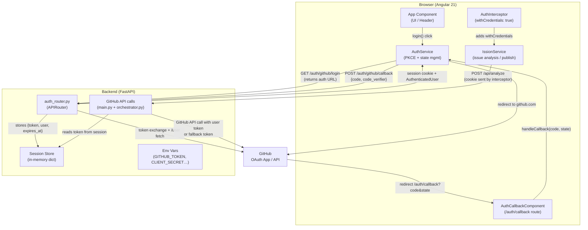
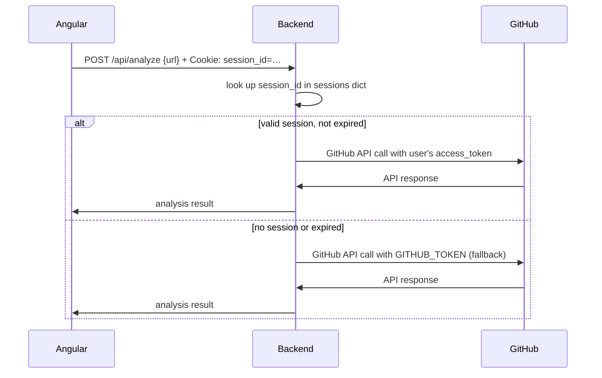

# Design Document

## Feature: GitHub OAuth Authentication

---

## Overview

This design adds GitHub OAuth 2.0 Authorization Code Flow with PKCE to the Ission Agent. The goal is to allow individual users to connect their own GitHub accounts so that issue analysis and comment publication happen under their identity rather than a shared service token. Authentication is optional: when no user session exists, the backend falls back to the global `GITHUB_TOKEN` environment variable, preserving existing behavior.

The architecture has three participants:

- **Angular frontend** — initiates the flow, generates PKCE parameters entirely in the browser via the Web Crypto API, and displays authentication state. It never sees or stores the GitHub access token.
- **FastAPI backend** — exchanges the authorization code for the access token using the `client_secret`, stores the token in a server-side session, and intermediates all GitHub API calls.
- **GitHub OAuth App** — the identity provider that issues access tokens after user consent.

Key security invariants that drive every design decision:

1. The GitHub access token **never leaves the backend** — it is never in any HTTP response body, URL, log, or cookie value visible to the browser.
2. Session state is transmitted via an **HTTP-only, SameSite=Strict cookie** — the frontend cannot read it via JavaScript.
3. The frontend only ever receives `{ login, avatar_url, name, is_authenticated }`.
4. All requests from Angular to the Ission backend carry `withCredentials: true` so the session cookie is sent automatically.

---

## Architecture

### System Architecture Diagram



### OAuth Flow Sequence

```mermaid
sequenceDiagram
    participant User
    participant Angular as Angular (Browser)
    participant Backend as FastAPI Backend
    participant GitHub as GitHub OAuth

    User->>Angular: clicks "Connect GitHub"
    Angular->>Angular: generate code_verifier (≥43 chars, Web Crypto)
    Angular->>Angular: compute code_challenge = base64url(SHA256(verifier))
    Angular->>Angular: generate state (≥16 bytes, Web Crypto)
    Angular->>Angular: store {verifier, state} in memory only
    Angular->>GitHub: redirect to github.com/login/oauth/authorize\n?client_id=…&state=…&code_challenge=…&code_challenge_method=S256

    GitHub->>User: authorization consent page
    User->>GitHub: approves
    GitHub->>Angular: redirect /auth/callback?code=…&state=…

    Angular->>Angular: validate state matches in-memory state
    Angular->>Backend: POST /auth/github/callback {code, code_verifier}
    Backend->>GitHub: POST /login/oauth/access_token\n{client_id, client_secret, code, code_verifier, redirect_uri}
    GitHub->>Backend: {access_token}
    Backend->>GitHub: GET /user (Authorization: Bearer access_token)
    GitHub->>Backend: {login, avatar_url, name}
    Backend->>Backend: create session {session_id → token + user + expires_at}
    Backend->>Angular: Set-Cookie: session_id=…; HttpOnly; SameSite=Strict\n+ body: {login, avatar_url, name}
    Angular->>Angular: update currentUser$ observable
    Angular->>Angular: clear {verifier, state, code} from memory
    Angular->>User: navigate to /
```

### Session Validation Flow (Subsequent Requests)



---

## Components and Interfaces

### Backend Modules

#### `auth_router.py` (new)

FastAPI `APIRouter` mounted at `/auth`. Handles all OAuth endpoints.

| Endpoint | Method | Description |
|---|---|---|
| `/auth/github/login` | GET | Returns the GitHub authorization URL. Validates that `GITHUB_CLIENT_ID` is set; returns 503 if not. |
| `/auth/github/callback` | POST | Receives `{code, code_verifier}`, exchanges for token, creates session, sets cookie, returns `AuthenticatedUser`. |
| `/auth/me` | GET | Reads session cookie, returns `AuthenticatedUser` or 401. |
| `/auth/logout` | POST | Invalidates session, clears cookie. |

#### `main.py` (modified)

- Include `auth_router` via `app.include_router(auth_router, prefix="")`
- Add `itsdangerous`-based cookie signing middleware or use `starlette.middleware.sessions`
- Modify `publish_comment` to read the token from the session when a valid cookie is present (via a shared `get_current_token` dependency)

#### `orchestrator.py` (modified)

- Modify `_fetch_github_issue` to accept an optional `token: str | None = None` parameter
- When token is provided, add `Authorization: Bearer <token>` header; otherwise omit (public access)
- Expose a `get_current_token(request: Request) -> str | None` FastAPI dependency that reads the session and returns the user's token or `None`

### Frontend Modules

#### `auth.service.ts` (new)

Core service. Manages PKCE generation, OAuth flow, session state, and API communication.

```
AuthService
  ├── currentUser$: BehaviorSubject<AuthenticatedUser | null>
  ├── isAuthenticated$: Observable<boolean>       (derived from currentUser$)
  ├── isLoading$: BehaviorSubject<boolean>
  ├── authError$: BehaviorSubject<string | null>
  ├── login(): void                               — generate PKCE, redirect to GitHub
  ├── handleCallback(code, state): Observable<void>
  ├── logout(): Observable<void>
  └── checkSession(): Observable<void>            — called on app init
```

PKCE state (`code_verifier`, `state`) is held as private class fields — never serialized to any Web Storage API.

#### `auth-status.component.ts` (new)

Standalone component embedded in the app header.

States:
- **Unauthenticated**: small "Connect GitHub" button with GitHub mark icon
- **Authenticated**: user avatar (24px circle), `@username` text, "Disconnect" link
- **Loading**: spinner while auth is in progress
- **Error**: brief inline error message (auto-dismisses after 5 s)

#### `auth-callback.component.ts` (new)

Route component for `/auth/callback`.

- Reads `code` and `state` from `ActivatedRoute.queryParams`
- Delegates to `AuthService.handleCallback()`
- Displays a full-page loading spinner while processing
- Navigates to `/` on success, shows error on failure

#### `auth.interceptor.ts` (new)

`HttpInterceptorFn` that adds `withCredentials: true` to every request targeting `http://localhost:8000`. Does not attach any `Authorization` header.

#### `app.config.ts` (modified)

```typescript
provideHttpClient(withInterceptors([authInterceptor]))
provideRouter(routes)   // routes now includes /auth/callback
```

#### `app.routes.ts` (modified)

```typescript
{ path: 'auth/callback', component: AuthCallbackComponent }
```

#### `ission.service.ts` (modified)

No code change needed if the interceptor is in place. The interceptor automatically adds `withCredentials: true` to all requests. As a belt-and-suspenders measure, existing calls can also pass `{ withCredentials: true }` explicitly in `HttpClient` options.

---

## Data Models

### Backend (Pydantic — Python)

```python
from pydantic import BaseModel
from datetime import datetime

class AuthenticatedUser(BaseModel):
    """Public user data returned to the frontend. Never includes the token."""
    login: str
    avatar_url: str
    name: str | None

class SessionData(BaseModel):
    """Server-side session. Never serialized to any HTTP response."""
    access_token: str
    user: AuthenticatedUser
    expires_at: datetime

class CallbackRequest(BaseModel):
    """Payload received from the frontend after the GitHub redirect."""
    code: str
    code_verifier: str

class AuthLoginResponse(BaseModel):
    """Response for GET /auth/github/login."""
    authorization_url: str

class ErrorResponse(BaseModel):
    detail: str
```

In-memory session store:

```python
# auth_router.py
sessions: dict[str, SessionData] = {}
# Key: session_id (secrets.token_urlsafe(32))
# Value: SessionData
```

### Frontend (TypeScript interfaces)

```typescript
export interface AuthenticatedUser {
  login: string;
  avatar_url: string;
  name: string | null;
}

export interface AuthLoginResponse {
  authorization_url: string;
}

/** PKCE parameters held in memory only — never exported or serialized */
interface PkceParams {
  codeVerifier: string;
  codeChallenge: string;
  state: string;
}
```

### Environment Variables (Backend)

| Variable | Required | Default | Description |
|---|---|---|---|
| `GITHUB_CLIENT_ID` | Yes | — | OAuth App client ID |
| `GITHUB_CLIENT_SECRET` | Yes | — | OAuth App client secret (never logged, never sent to frontend) |
| `GITHUB_REDIRECT_URI` | No | `http://localhost:4200/auth/callback` | Must match GitHub OAuth App config exactly |
| `SESSION_SECRET_KEY` | Yes | — | Key for signing session cookies (itsdangerous) |
| `SESSION_TTL_HOURS` | No | `8` | Session TTL in hours |
| `GITHUB_TOKEN` | No | — | Fallback token for unauthenticated requests |

---

## Correctness Properties

*A property is a characteristic or behavior that should hold true across all valid executions of a system — essentially, a formal statement about what the system should do. Properties serve as the bridge between human-readable specifications and machine-verifiable correctness guarantees.*

### Property 1: PKCE code_verifier validity

*For any* invocation of the code_verifier generation function, the resulting string SHALL have a length of at least 43 characters and contain only characters from the unreserved URI character set `[A-Za-z0-9\-._~]`.

**Validates: Requirements 1.1**

---

### Property 2: PKCE code_challenge derivation integrity

*For any* code_verifier generated by the Auth_Service, the corresponding code_challenge SHALL equal the Base64 URL-safe encoding of the SHA-256 digest of the code_verifier (i.e., `base64url(SHA256(code_verifier))`).

**Validates: Requirements 1.2**

---

### Property 3: OAuth state uniqueness

*For any* collection of N OAuth flow initiations (N ≥ 2), all generated `state` values SHALL be distinct — no two initiations ever produce the same state string.

**Validates: Requirements 7.1**

---

### Property 4: State mismatch aborts flow and clears PKCE parameters

*For any* pair of (stored_state, received_state) where `stored_state ≠ received_state`, invoking `handleCallback` SHALL result in an error state being emitted AND all PKCE parameters (`code_verifier`, `state`) being cleared from memory.

**Validates: Requirements 2.3, 7.1**

---

### Property 5: Token isolation across all surfaces

*For any* GitHub access token value used in a session, that token string SHALL NOT appear in:
- any HTTP response body returned by the Ission backend,
- any URL or redirect target produced by the backend,
- any application log output.

This covers both the token exchange response (`POST /auth/github/callback`) and all subsequent API responses (`/api/analyze`, `/api/publish-comment`, `/auth/me`).

**Validates: Requirements 3.3, 6.5, 6.6**

---

### Property 6: Token selection correctness

*For any* incoming request to the Ission backend:
- If the request carries a valid, non-expired session cookie, the GitHub API call SHALL use the `access_token` stored in that session.
- If the request carries no session cookie or an invalid/expired one, the GitHub API call SHALL use the `GITHUB_TOKEN` environment variable (Fallback_Token).

These two cases are mutually exclusive and exhaustive.

**Validates: Requirements 6.1, 6.2, 6.3**

---

### Property 7: Logout always clears local authentication state

*For any* response from `POST /auth/logout` — whether a success (2xx), a network error, or any server error — the Auth_Service SHALL set `currentUser$` to `null` and `isAuthenticated$` to `false` after the logout attempt completes.

**Validates: Requirements 5.2, 5.5**

---

### Property 8: redirect_uri validation rejects non-matching values

*For any* token exchange request where the `redirect_uri` parameter does not exactly equal the value configured in `GITHUB_REDIRECT_URI`, the OAuth_Controller SHALL reject the request and return HTTP 400 without attempting to contact GitHub.

**Validates: Requirements 7.3**

---

## Error Handling

### Backend Error Responses

| Scenario | HTTP Status | Behavior |
|---|---|---|
| `GITHUB_CLIENT_ID` not set | 503 | `{"detail": "GitHub OAuth not configured"}` |
| GitHub returns error during token exchange | 400 | Descriptive message; authorization code and partial token NOT logged |
| Session cookie missing or not found in store | 401 | `{"detail": "Not authenticated"}` |
| Session expired | 401 | Same as above; expired session entry cleaned up |
| redirect_uri mismatch | 400 | `{"detail": "redirect_uri mismatch"}` |
| GitHub API returns 401 (expired user token) | 401 forwarded to client | Frontend clears auth state |
| Unexpected server error | 500 | Generic message; sensitive values redacted from logs |

### Frontend Error Handling

| Scenario | Auth_Service behavior | UI behavior |
|---|---|---|
| Web Crypto API unavailable | emit error to `authError$` | inline error in auth-status component |
| state mismatch on callback | emit error, clear PKCE, navigate to / | error notification, retry available |
| Network error during callback POST | emit error to `authError$` | "Connection failed" notification with "Try Again" |
| Callback route reached without code/state | navigate to / immediately | error notification |
| Backend 503 (OAuth not configured) | emit error | "GitHub login unavailable" message |
| `/auth/me` returns 401 on app load | set unauthenticated silently | show "Connect GitHub" button |
| POST /auth/logout fails | still clear local state | treat user as unauthenticated |

Error notifications auto-dismiss after 5 seconds. The "Connect GitHub" button is disabled while authentication is in progress.

---

## Testing Strategy

### Dual Testing Approach

The feature uses two complementary layers:

1. **Property-based tests** — verify the 8 correctness properties above across 100+ randomly generated inputs. Use [fast-check](https://fast-check.io/) for TypeScript (frontend) and [hypothesis](https://hypothesis.readthedocs.io/) for Python (backend).
2. **Example-based unit tests** — cover specific behavioral sequences (OAuth flow steps, error paths, UI state transitions) and integration points.

### Property-Based Tests

Each property test runs a minimum of **100 iterations**.

Tag format for each test: `Feature: github-oauth-authentication, Property {N}: {property_text}`

| Property | Implementation notes |
|---|---|
| P1: code_verifier validity | Generate via `authService.generateCodeVerifier()`, assert length ≥ 43 and regex `[A-Za-z0-9\-._~]+` |
| P2: code_challenge derivation | For arbitrary code_verifier strings, compute expected challenge independently and compare |
| P3: state uniqueness | Generate 100 states, insert into a Set, assert Set size equals 100 |
| P4: state mismatch clears PKCE | Use fast-check to generate pairs of non-equal strings, call handleCallback with mismatched state |
| P5: token isolation | Use hypothesis to generate arbitrary token strings, mock GitHub to return them, assert response bodies and log output do not contain the token |
| P6: token selection | Use hypothesis to generate sessions with/without valid entries, verify correct token is passed to GitHub API mock |
| P7: logout clears state | Use hypothesis to generate arbitrary HTTP error responses from /auth/logout, assert currentUser$ becomes null |
| P8: redirect_uri rejection | Use fast-check to generate strings that differ from configured redirect_uri, assert 400 is returned |

### Example-Based Unit Tests

**Frontend (Vitest + Angular TestBed):**
- `AuthService.login()` — verifies PKCE params are NOT written to localStorage/sessionStorage/cookies
- `AuthService.handleCallback()` with matching state — verifies user observable is updated
- `AuthService.checkSession()` — verifies GET /auth/me is called on init; handles 401 silently
- `AuthCallbackComponent` — verifies navigation on success and error display on failure
- `AuthStatusComponent` — verifies correct template branch renders for each auth state
- `AuthInterceptor` — verifies `withCredentials: true` is added to requests targeting localhost:8000

**Backend (pytest):**
- `GET /auth/github/login` — returns correct URL with all PKCE parameters; returns 503 when CLIENT_ID is absent
- `POST /auth/github/callback` — full mock flow; verifies Set-Cookie header has HttpOnly + SameSite=Strict
- `GET /auth/me` — valid session returns user; missing/expired session returns 401
- `POST /auth/logout` — session is removed from store; cookie is cleared
- `get_current_token` dependency — returns user token when session is valid; returns GITHUB_TOKEN when not

### Integration Points with Existing Code

| File | Change | Test approach |
|---|---|---|
| `main.py` | Include `auth_router`; add `get_current_token` dependency to `/api/analyze` and `/api/publish-comment` | Example tests for both endpoints verifying correct token is forwarded |
| `orchestrator.py` | `_fetch_github_issue` accepts optional `token` param | Unit test with and without token; verify Authorization header presence |
| `ission.service.ts` | Rely on interceptor for `withCredentials`; no breaking change | Existing tests remain valid |
| `app.config.ts` | Add `withInterceptors([authInterceptor])`, `provideRouter(routes)` | No dedicated test; covered by interceptor unit test |
| `app.routes.ts` | Add `/auth/callback` route | Covered by `AuthCallbackComponent` tests |

### Production Considerations (Out of Scope for This Sprint)

- Replace in-memory `sessions` dict with **Redis** (use `aioredis` + a background TTL expiry task)
- Enable **HTTPS** for all backend-to-GitHub communication (required by GitHub in production)
- Implement **session rotation** on successful token exchange to prevent session fixation
- Add **rate limiting** to `/auth/github/callback` to mitigate brute-force on authorization codes
