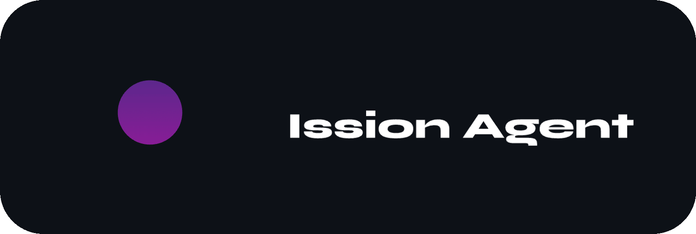
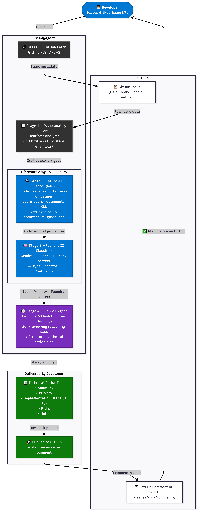

<div align="center">



### Turn GitHub Issues into Architecture-Aware Development Plans

Powered by Azure AI Foundry, Azure AI Search (RAG), Google Gemini 2.5 Flash and a 5-Stage AI Reasoning Pipeline.


</div>


# 🚨 The Problem

Before a developer can fix an issue, someone must:

- Understand the problem
- Identify missing information
- Check architectural constraints
- Define an implementation strategy

This process is often manual, repetitive, and dependent on senior engineers.


## 💡 The Solution
 
Ission Agent automates issue triage through a **5-stage AI reasoning pipeline**.
 
Given a GitHub Issue URL, the agent:
 
✅ Fetches the raw issue data from GitHub 

✅ Evaluates issue quality with a deterministic heuristic score 

✅ Retrieves architecture guidelines via Azure AI Search (RAG)  

✅ Classifies the issue using Azure AI Foundry + Gemini 2.5 Flash  

✅ Generates a structured technical implementation plan  

✅ Publishes the final plan back to GitHub as a comment  


# 🧠 Reasoning Pipeline




# 🏗️ System Architecture

```text
┌──────────────────────────┐
│     Angular 19 Frontend  │
│   (Thought Stream UI)    │
└───────────┬──────────────┘
            │ GitHub OAuth
            ▼
┌──────────────────────────┐
│   FastAPI Backend        │
│   Orchestrator           │
└──────┬──────────┬────────┘
       │          │
       ▼          ▼
 GitHub REST    Microsoft Azure AI Foundry
 API v3         ├── Azure AI Search (RAG)
                │   recall-architecture-guidelines
                └── Foundry IQ Classifier
                    + Gemini 2.5 Flash
                        │
                        ▼
                   Planner Agent
                   Gemini 2.5 Flash
                   (built-in thinking)
                        │
                        ▼
               GitHub Comment API
               POST /issues/{id}/comments
```


## ✨ Key Features
 
-  GitHub OAuth authentication
-  Issue Quality Scoring (0–100, deterministic heuristic)
-  Architecture-Aware RAG via Azure AI Search
-  AI Classification — type, priority & confidence score
-  Structured Technical Action Plan (8–10 implementation steps, risks & notes)
-  Transparent Thought Stream Visualization
-  One-click publish back to GitHub
-  Local deterministic fallback — 100% availability guaranteed


# 🛠️ Tech Stack

### Frontend
- Angular 19
- TypeScript 5.x
- SCSS

### Backend
- FastAPI 0.115
- Python 3.11+
- AsyncIO

### AI / Cloud
- Azure AI Foundry
- Azure AI Search (RAG — `recall-architecture-guidelines` index)
- Google Gemini 2.5 Flash (Classifier + Planner)

### Integrations
- GitHub REST API v3
- GitHub OAuth
- GitHub Comment API


# 🚀 Quick Start

### Backend

```bash
cd backend

pip install -r requirements.txt

uvicorn main:app --reload
```

### Frontend

```bash
cd frontend

npm install

ng serve
```


## Built for the Microsoft Agents League Hackathon

Ission Agent demonstrates how Azure AI Foundry and LLM reasoning can reduce the time spent understanding and planning software work before implementation begins.
